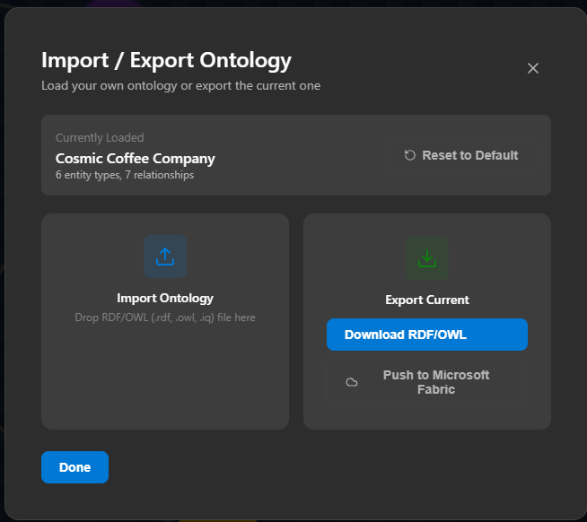
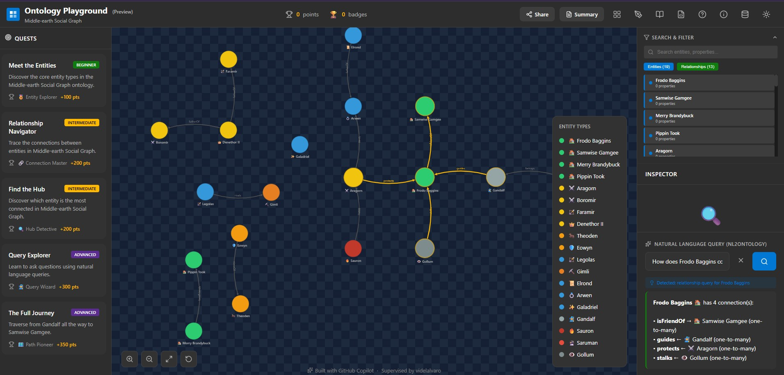
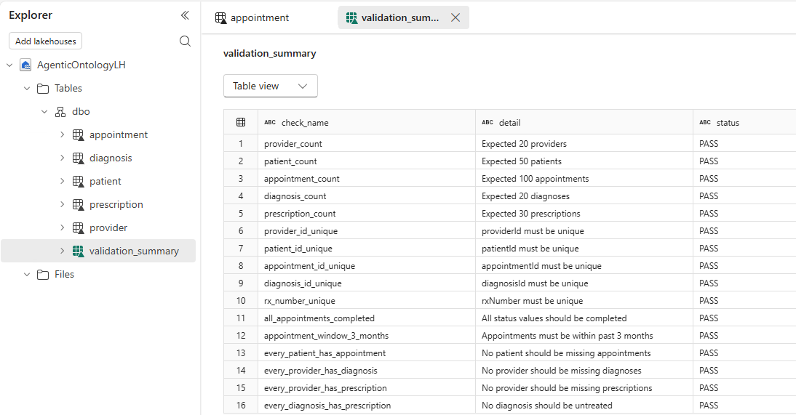
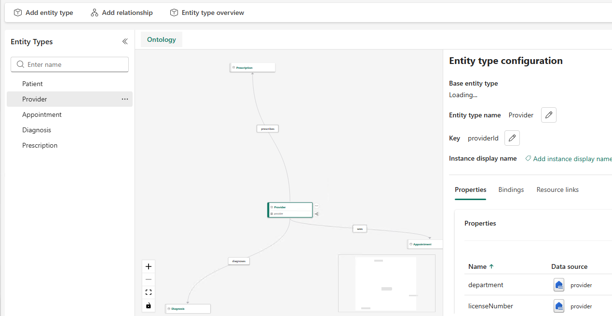
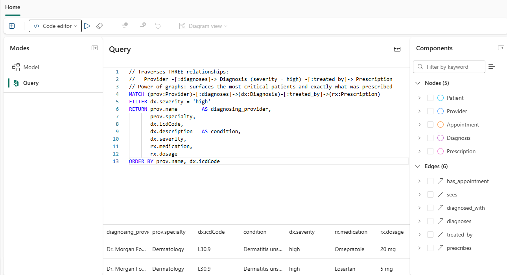
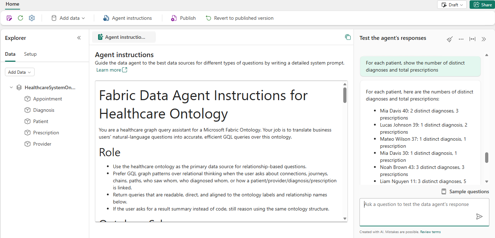

# build-fabric-ontology-demo
Build a Microsoft Fabric Ontology demo in under one hour!
* Fast Path - just grab the notebooks and install a demo
* Custom Path - create your own Ontology and demo data. This will require  editing the Goals.md file, and asking your Copilot to regenerate the notebook files for the Lakehouse tables and Ontology.

# FAST PATH - INSTALL EXISTING DEMO
Just want to install an Ontology demo for Healthcare, with demo data, and try out a data agent? 
1. Create a Fabric Workspace and a Lakehouse
2. Upload the notebooks from the notebooks folder into your workspace
3. Run the notebook 00_orchestrate_all to run notebooks 01-05 and create your Lakehouse tables
4. Review the 'Verification' table in the lakehouse to ensure your demo data was successfully generated.
5. Run the Create_Healthcare_Ontology notebook. 
    * Note: Creating the underlying graph db in Fabric can be slow: it took about 11 minutes on an F64 capacity before everything is ready.
6. Create a Fabric Data Agent and use your Ontology as a data source
7. Use data_agent_instructions.md as the AI instructions for your data agent
8. Try it out! See how the data_agent_prompts.md work with your agent.

# CUSTOM PATH - BRING YOUR OWN ONTOLOGY
## SETUP YOUR EDITING ENVIRONMENT
I built my custom demo using the following tools:
1. VS Code
2. GitHub Copilot, with a _good_ model (like ChatGPT 5.4)
3. [Skills for Microsoft Fabric](https://github.com/microsoft/skills-for-fabric)
4. [Microsoft Learn MCP Server](https://learn.microsoft.com/en-us/training/support/mcp)

## CREATE AN ONTOLOGY
* Begin with the [Ontology Playground](https://microsoft.github.io/Ontology-Playground/) to create your own Ontology from scratch, or modify an existing one.

* Export your Ontology design as a .RDF file - It's the file icon in the upper-right corner of the Ontology playground. 

* Fun fact! You can ask M365 Copilot, or ChatGPT, etc. to create an Ontology.rdf file for you using an existing RDF file as a file. 
* For example, I prompted an LLM for the "Lord of the Rings" ontology using one of the Playground samples as an example. It worked!

## CREATE THE LAKEHOUSE TABLES AND DATA
At this point, you should have:
1. VS Code with your add-ins
2. The files from this repo
3. Your own ontology.rdf file that you want to build
4. A Fabric Workspace and Lakehouse where you can build this demo.

EDIT THE GOALS.MD FILE
* Full disclosure: I didn't run the entire Goals.md file at once, I asked the coding agent (GitHub Copilot) to run it one step at a time. I also asked to see a plan before each step, and had to explain myself once or twice.
* For the table creation, your .RDF file already contains table names, columns, and data types, so your request is straightforward.
* I focused a lot of attention on asking for specific demo data, as you can see. With a small data set like this, it can be challenging to create interesting multi-hop queries, so I focused attention on that.
* No Date Table - this Healthcare ontology has Appointments, so I needed to be extra-clear here: No appointments in the future, everything in last 3 months, etc. Because I focused solely on Data Agents and not Power BI Reports, I didn't create a Date Table, but if you intend to build reports, that might be handy.

### A PLEASANT SURPRISE
* GitHub Copilot, and this really shows the value of using a good model, proactively asked me if I wanted an 'orchestration notebook' to create the table-building notebooks. Of course I said yes! 
* Copilot also volunteered to build a validation table and double-check that the demo data had been created to my specifications.

## CREATE THE ONTOLOGY (and Graph database)
Moving onto Step 2 and Step 2.5 in the GOALS.MD file, now that I had Lakehouse tables built and populated, we can create an Ontology.
* I didn't want to create a Semantic Model on top of the tables and then an Ontology on top of the semantic model. If I was starting from an existing Power BI semantic model, I likely would have, but starting from Ontology Playground, it seems redundant.
* In Step 2, I asked for extremely simple click-by-click directions to build the Ontology by hand. I've used the Create Ontology tutorial in the documentation, and kept getting confused over the direction of the relationships, etc. so I wanted an assumption-free, easy-to-follow path through the UI.
    * It was a lot of clicks! 
* Having a Semantic Link Labs notebook use the REST API to create the Ontology was pretty straightforward. 
* But teaching Copilot how to author a sempy notebook took a little work. Skills for Fabric does have some authoring skills, but I took it further by asking another LLM to create the sempy-notebook SKILL.md file. Microsoft has done a great job documenting the semantic link library and providing sample notebooks, including the [Microsoft Fabric Community Notebook Gallery](https://community.fabric.microsoft.com/t5/Notebook-Gallery/bd-p/pbi_notebookgallery), so I provided the LLM with both documentation and working samples. 
* After that, GitHub Copilot easily created the notebook, I uploaded it, and it built the ontology on the first try.

* Note that Graph DB takes awhile: I resized my F64 up to an F128 for this step, it still seems to take 10-15 minutes before it's ready.

## CREATE SOME FUN GRAPH DB QUERIES
The real power of Ontology and graph databases come from making these friend-of-a-friend-of-a-friend-of-a-friend connetions. When you get to 4 or 5 hops, these queries become near impossible to run in the relational model, yet take seconds (if that) using Graph.

* Graph queries provide insight and context that relational queries cannot uncover.
* Graph queries are reproducible, explainable, and auditable - they're GQL statements you can read and re-run. 
* Contrast that with LLM insights, which are probabilistic, and not necessarily reproducible. 
So the challenge was on: Can we create fun Graph queries that show this off? 
* Step 3 of the GOALS.MD file asked for those queries.
* I was surprised to see Copilot struggle to write good Graph queries - I thought it would be easy. Looking at the error messages, I realized there's more than one Graph language on the internet. Microsoft documentation to the rescue! Once I provided the documentation for Fabric's graph language and working example, I got what I wanted - working multi-hop queries.
* I turned those learnings into the fabric-graphdb-query skill.md so hopefully the next person who has to do this can just reference the skill file and the Copilot will jump to it.

## BUILD YOUR DATA AGENT
Building the Data Agent itself was incredibly easy
* One step - add the Ontology as a data source. You're ready to start prompting the data agent right away. 

* Since we had all this great information about the Ontology itself, the lakehouse tables, and some working graph db queries, it was easy to ask the Copilot to generate an AI Instructions file
1. GOALS.MD Step 4 asks for the AI instructions file and adds a few constraints, like the 10,000 character limit for the file
2. I asked for some sample data agent prompts, to ensure that natural language was aligning with the Ontology contents.
