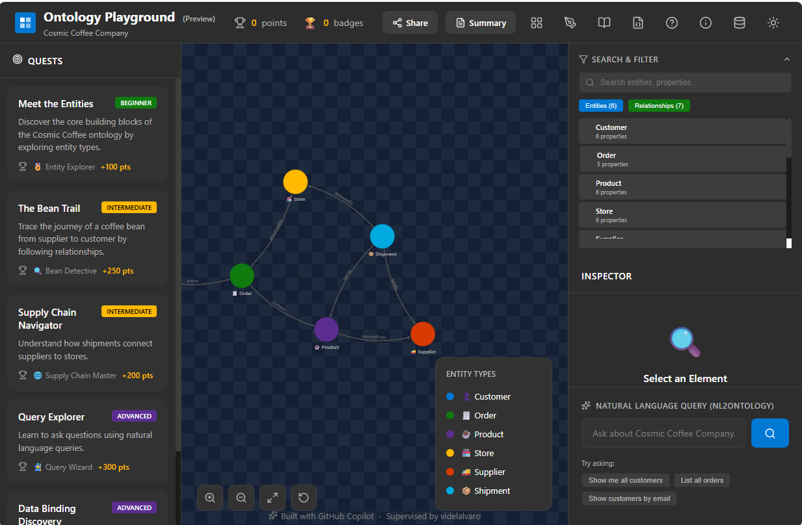

# build-fabric-ontology-demo
Build a Microsoft Fabric Ontology demo in under one hour!
* Fast Path - just grab the notebooks and install a demo
* Custom Path - create your own Ontology and demo data. Requires editing Goals.md, and regenerating 

# FAST PATH - INSTALL EXISTING DEMO
* Just want to install an Ontology demo for Healthcare, with demo data, and try out a data agent? 
1. Create a Fabric Workspace and a Lakehouse
2. Upload the notebooks from the notebooks folder into your workspace
3. Run the notebook 00_orchestrate_all to run notebooks 01-05 and create your Lakehouse tables
4. Review the 'Verification' table in the lakehouse to ensure your demo data was successfully generated.
5. Run the Create_Healthcare_Ontology notebook. 
    * Note: Creating the underlying graph db in Fabric can be slow: it took about 11 minutes on an F64 capacity before everything is ready.
6. Create a Fabric Data Agent and use your Ontology as a data source
7. Use data_agent_instructions.md as the AI instructions for your data agent
8. Try it out! See how the data_agent_prompts.md work with your agent.

# CUSTOM PATH
* Begin with the Ontology Playground to create your Ontology or modify an existing one
* Export your Ontology design as a .RDF file

* to be continued....
